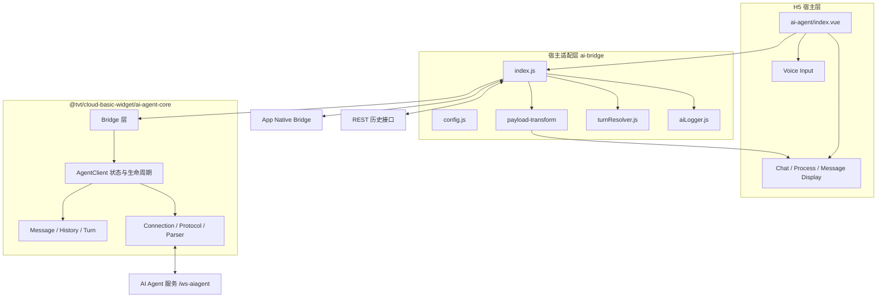
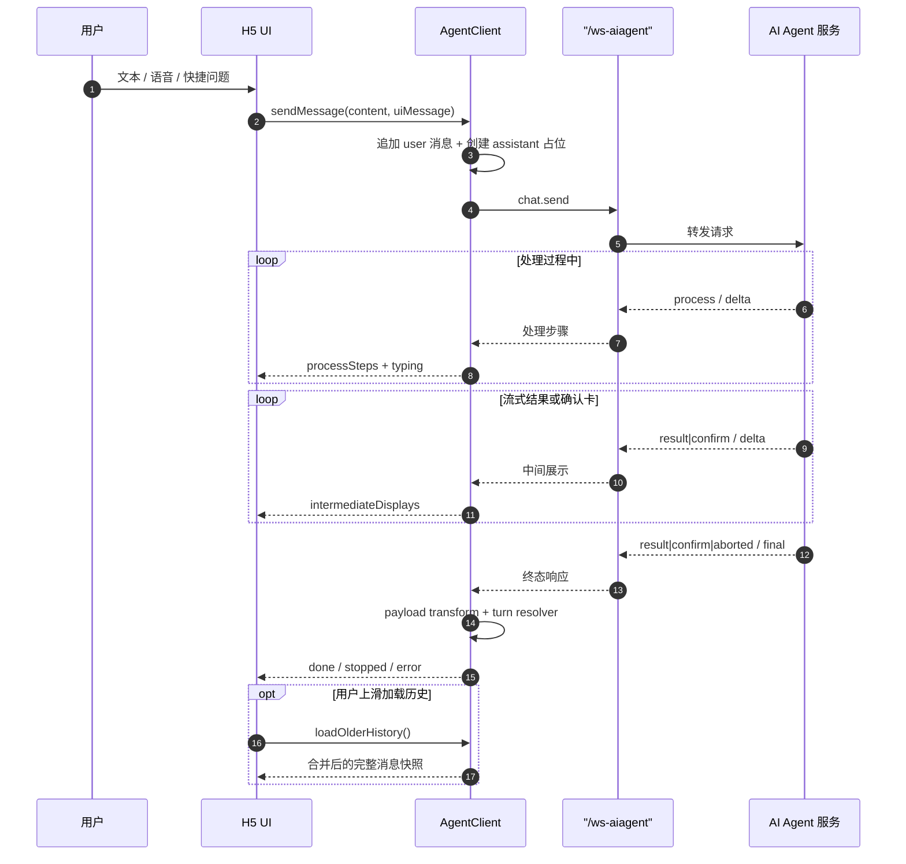
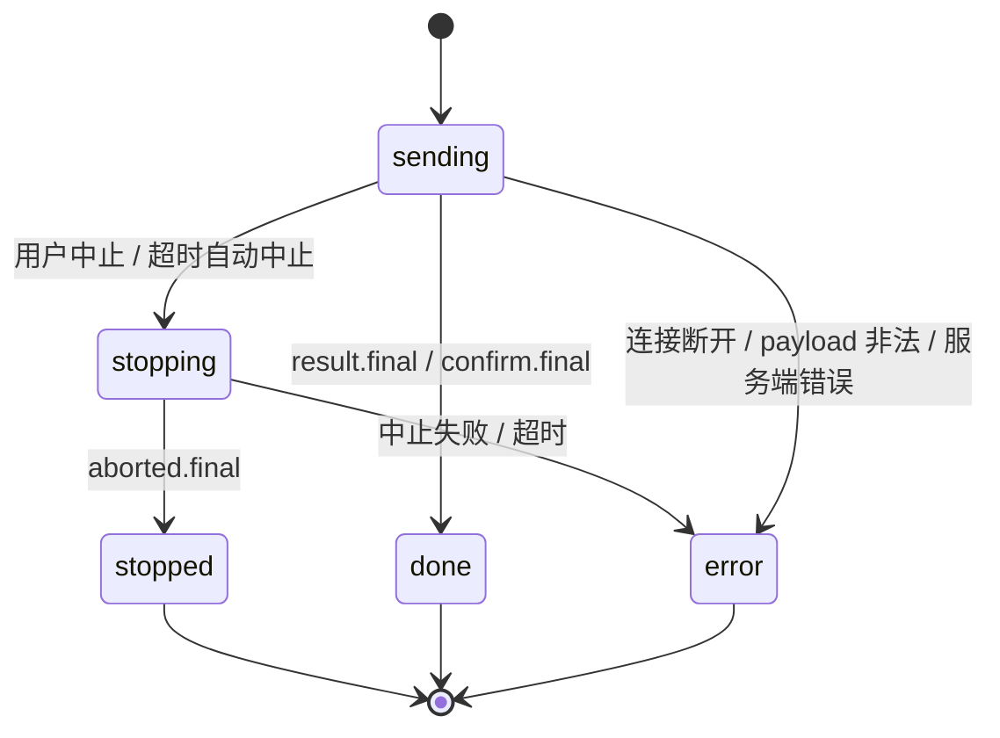
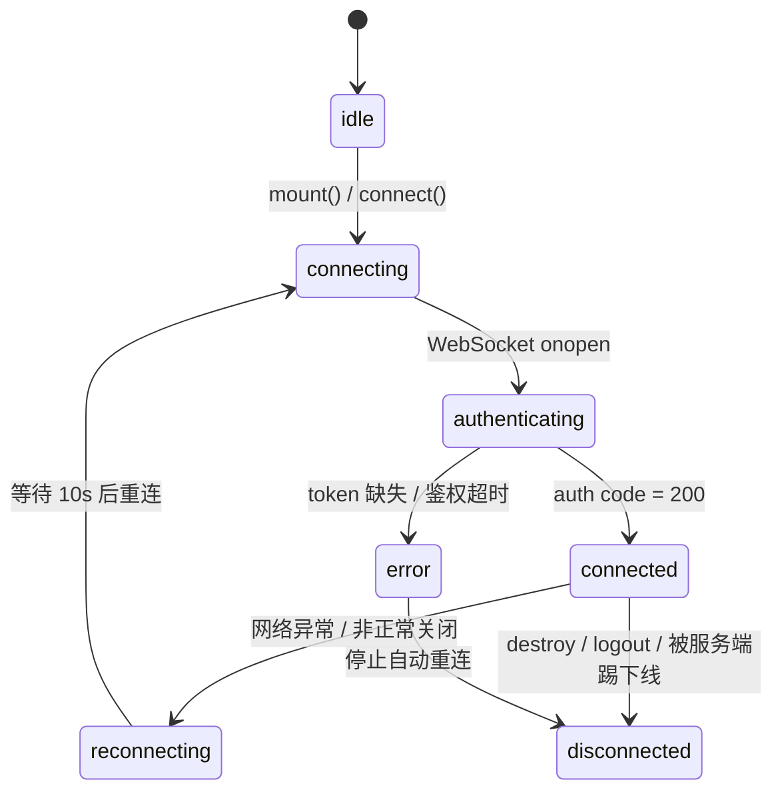
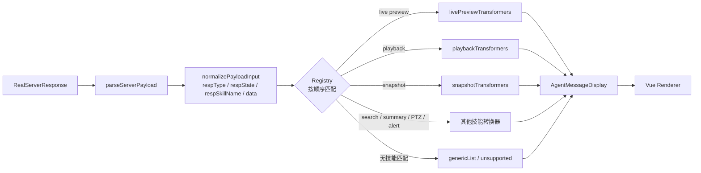
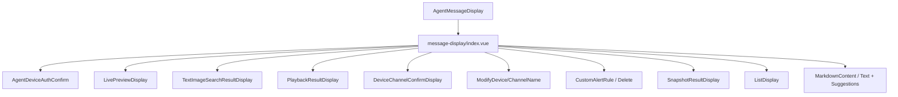
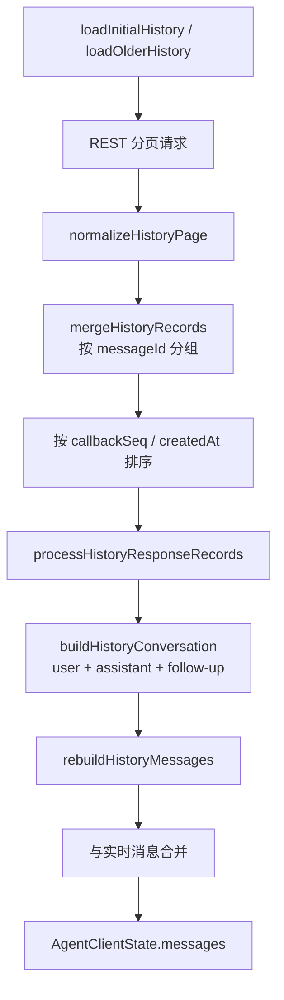

# 不止是聊天框：TVT H5 智能助手的分层架构设计与工程实践

本文由AI生成, 人类负责审核, 开发过程也是如此, 以此文记录智能助手的设计方案

## 摘要

在 H5/WebView 中接入 AI，并不等于在页面上放一个聊天输入框。真正的难点在于：AI 的返回是流式的、阶段化的、随技能变化的；H5 又需要连接页面路由、App 原生能力、鉴权体系、历史消息和复杂业务卡片。只要把 WebSocket 监听、业务判断和 UI 渲染直接写进页面，系统很快就会演变成难以维护的事件中心。

TVT H5 智能助手采用的思路是：把“协议、连接、状态、业务转换、UI 渲染”拆成清晰的多层结构，让核心运行时保持业务无关，让宿主页面只负责注册上下文、转换技能结果和渲染业务卡片。最终形成了一套从 `AgentBridge` 到 `AgentClient`、再到 WebSocket 协议处理和 Vue 消息渲染器的完整链路。

本文将结合真实代码，从总体架构、一次问答的完整链路、协议处理、技能扩展、富交互消息、历史恢复、稳定性与可观测性等角度，拆解这套 H5 智能助手的设计思路、工程价值和取舍。

---

## 1. 为什么“直接接一个聊天接口”不够

智能助手承载的业务并不是普通问答。当前页面需要支持以下能力：

- 设备实时预览、回放、抓图、录像检索；
- 设备与通道选择、设备授权、名称修改；
- PTZ 预置点查询与云台控制；
- 自定义告警规则的新增与删除；
- 告警事件摘要、快捷问题、下一步引导；
- 文本输入、按住说话、语音识别与手势取消；
- 历史消息分页、断线恢复、消息中止和失败重试。

这意味着它至少要同时解决五类问题：

1. **流式协议问题**：服务端会持续下发 `process`、`result`、`confirm`、`aborted` 等响应，并有 `delta/final` 两种状态。
2. **动态技能问题**：不同技能的数据结构完全不同，不能把业务结构直接塞进聊天组件。
3. **跨端桥接问题**：H5 需要访问 App 的语音识别、系统设置、页面跳转和登录态。
4. **移动网络问题**：WebSocket 会断、请求会超时、token 会过期、原生页面可能重新唤起。
5. **交互安全问题**：设备控制、预览、改名、告警规则等动作必须经过用户确认，不能由模型直接执行。

因此，我们真正要建设的不是“聊天页”，而是一套可以承接 AI 能力、业务技能和 App 原生能力的 **H5 Agent Runtime**。

---

## 2. 设计目标

这套架构围绕六个目标展开：

| 目标 | 具体含义 |
| --- | --- |
| 解耦 | 核心不识别 TVT 业务，宿主页面不直接处理 WebSocket 细节 |
| 复用 | 核心运行时沉淀到 `@tvt/cloud-basic-widget`，其他 H5 可复用 |
| 扩展 | 新技能只需要增加 transformer 和 renderer |
| 稳定 | 支持鉴权、心跳、重连、超时、中止、去重和历史恢复 |
| 安全 | 能力有风险等级、确认机制，日志对 token 做脱敏 |
| 体验 | 支持流式过程、富消息、虚拟列表、语音、快捷建议和滚动锚定 |

核心设计原则只有一句话：

> **核心不认识业务，宿主不关心协议；AI 输出先标准化，再按技能转换为可交互 UI。**

---

## 3. 总体架构

### 3.1 五层结构



这五层分别承担以下职责。

### 3.2 协议契约层

核心协议定义在：

`ai-agent-core\protocol.ts`

它统一定义了：

- `ProtocolEnvelope`：带 `id/type/source/target/sessionId/traceId` 的统一事件信封；
- `AgentClientState`：页面唯一需要订阅的状态快照；
- `AgentMessageDisplay`：`markdown`、`text`、`list`、`card`、`custom` 五类展示协议；
- `CapabilityDescriptor` 与 `CapabilityCallPayload`：宿主能力描述与调用契约；
- `AgentHostBridge`：核心运行时反向依赖宿主的最小接口；
- `AgentErrorInfo`：跨连接、消息、历史、鉴权的统一错误模型。

这是整个架构的“宪法”。只要这层稳定，上层页面和底层连接就可以独立演进。

### 3.3 Bridge 层

Bridge 是 H5 宿主和 Agent Core 之间的边界。宿主可以：

- 注册 `route`、`page` 等上下文提供者；
- 注册 `page.navigate`、`gotoAppPage` 等宿主能力；
- 监听 `agent:*` 事件；
- 提供 token、刷新 token、历史分页接口；
- 注入 `transformServerPayload` 和 `turnResolver`。

核心接口的关键部分如下：

```ts
export interface AgentHostBridge {
  protocolVersion: string;
  appId?: string;
  getClientInfo: () => Promise<AgentBridgeClientInfo>;
  getCapabilityList: () => CapabilityDescriptor[];
  invokeCapability: (call: CapabilityCallPayload) => Promise<CapabilityResultPayload>;
  transformServerPayload?: TransformServerPayload;
  turnResolver?: AgentTurnResolver;
  refreshAuthToken?: (serverCode?: number) => Promise<string | undefined>;
  onAgentEvent?: (event: ProtocolEnvelope) => void;
}
```

这种设计让核心库不依赖 Vuex、Router 或 App SDK，而是通过接口注入宿主环境。

### 3.4 Client 与状态层

页面不直接监听 WebSocket，也不直接修改消息数组，只订阅 `AgentClientState`：

```ts
const client = result.client;
const unsubscribe = client.subscribe(state => {
  this.messages = state.messages.slice();
  this.connected = state.connected;
  this.isTyping = state.isTyping;
  this.history = { ...state.history };
});
```

内部使用轻量 Signal 维护状态，并在变更后生成不可变快照：

```ts
function createStateSnapshot(): AgentClientState {
  applyMessageReadOnlyState();
  return {
    messages: messages.value.slice(),
    connected: connected.value,
    connectionStatus: connectionStatus.value,
    isTyping: isTyping.value,
    isAborting: isAborting.value,
    history: { ...historyState.value },
    sessionId: sessionId.value || undefined,
    lastErrorInfo: lastErrorInfo.value,
  };
}
```

这样做带来三个直接收益：

1. UI 只消费状态，不需要理解协议；
2. 历史消息、实时消息和本地语音预览可以统一渲染；
3. 状态变化路径可测试、可追踪，而不是散落在组件事件里。

### 3.5 Connection 与 Protocol 层

连接层负责：

- WebSocket 创建、鉴权、心跳与重连；
- 请求 ID、pending request 和超时管理；
- `auth / message / abort` 三类请求；
- 原始报文解析、响应阶段判断和错误分类；
- 响应去重、历史补偿、token 过期重试。

协议层把服务端响应归一到可处理的阶段，例如：

- `process.delta`
- `result.delta`
- `result.final`
- `confirm.delta`
- `confirm.final`
- `aborted.final`

核心库和 UI 都不再关心服务端字段组合的细节。

### 3.6 宿主业务层

宿主业务层由三部分组成：

1. `ai-bridge`：把 HTTP API、App Bridge、路由、登录态和 token 注入核心运行时；
2. `payload-transform`：把技能响应转换为统一展示协议；
3. `views/ai-agent`：聊天、欢迎页、消息卡、确认卡、虚拟列表和语音输入。

因此，核心库解决“怎么稳定地聊”，宿主解决“聊什么、怎么展示、能做什么”。

---

## 4. 核心设计一：契约驱动，而不是页面直连

### 4.1 宿主与核心之间只有一组契约

核心需要宿主提供四类信息：

| 契约 | 作用 |
| --- | --- |
| `getAuthToken` | 登录 token 由宿主提供，核心不接触业务登录接口 |
| `fetchHistoryPage` | 历史数据由宿主 API 适配，核心只处理标准分页结构 |
| `transformServerPayload` | 业务技能由宿主转换，核心只负责调度 |
| `turnResolver` | 某一轮回答完成后的业务修正由宿主决定 |

这不仅降低了耦合，也让核心库可以发布为独立 npm 包。当前 `@tvt/cloud-basic-widget` 已经通过 `./lib/ai-agent-core` 暴露构建产物和类型声明。

### 4.2 上下文与能力通过注册进入 Agent

宿主注册页面上下文：

```js
agentBridge.registerContextProvider('route', async () => getRouteContext());
agentBridge.registerContextProvider('page', async () => getPageContext());
```

同时注册可被 Agent 识别的能力：

```js
agentBridge.registerCapability('page.navigate', {
  riskLevel: 'low',
  schema: {
    type: 'object',
    properties: {
      path: { type: 'string' },
      replace: { type: 'boolean' },
    },
  },
  handler: async params => navigateInHost(params),
});
```

能力描述包含 `riskLevel`、`requiresUserConfirm`、`schema` 和 `timeoutMs`。这意味着未来即使开放更多设备控制能力，也可以先在协议层明确风险等级和确认要求，而不是让每个页面自行判断。

当前真实业务流程中，大部分技能仍通过“服务端下发确认卡 → 用户点击 → 卡片回传消息”的方式完成；Bridge 的 capability 机制则为后续更通用的宿主能力调用预留了统一入口。

### 4.3 事件模型统一为 Envelope

Bridge、Agent 和 Host 之间的事件都使用同一套信封：

```ts
interface ProtocolEnvelope<TPayload = unknown> {
  id: string;
  type: string;
  protocolVersion: string;
  source: 'bridge' | 'aiagent' | 'server';
  target?: 'host' | 'bridge' | 'aiagent' | 'server';
  sessionId?: string;
  timestamp: number;
  payload?: TPayload;
  traceId?: string;
}
```

统一信封的价值不在于“多包了一层”，而在于：

- 不同来源的事件可以统一调试；
- 请求、响应和页面事件都能带 `traceId`；
- 后续接入多 Agent、多会话时，协议层无需推倒重来。

---

## 5. 核心设计二：一次问答如何贯穿所有层

### 5.1 从用户输入到最终回答



这条链路中，有几个关键设计值得单独说明。

### 5.2 先落用户消息，再等待服务端回答

调用 `sendMessage` 时，核心会立即：

1. 校验当前连接和是否已有消息在处理；
2. 追加用户消息；
3. 创建 assistant 占位消息；
4. 生成请求 ID，并登记 pending request；
5. 发送 `chat.send`；
6. 标记 `isTyping = true`。

因此用户会立刻看到自己的消息和助手“正在思考”的反馈，而不是等待服务端首包后才渲染。

### 5.3 同一时间只处理一条消息

连接层在发送前会检查：

```ts
if (isTyping.value || pendingAssistantId.value) return;
if (!connected.value || !ws || ws.readyState !== WebSocket.OPEN) return;
```

这是一个非常重要的产品决策。AI 回复可能包含过程、多个 delta、确认卡和 follow-up，如果允许并发发送，同一轮回答很容易出现消息串线、确认状态错乱和撤销关系不明确。当前设计明确限制为“单轮串行”，换取更可控的状态和交互。

### 5.4 消息状态机



消息状态不是简单的 `loading/done`，原因在于“中止”本身也是异步协议：

- 用户点击停止后，消息先进入 `stopping`；
- 服务端返回 `aborted.final` 后才进入 `stopped`；
- 如果中止请求失败，消息要恢复到 `sending` 或进入 `error`；
- 超时会复用中止协议，但使用 `abortType = TIMEOUT`。

这种设计保证了 UI、服务端和本地 pending request 三方状态一致。

### 5.5 连接状态机



在当前 H5 中，WebSocket 地址由页面协议自动推导：

```js
const { host, protocol } = window.location;
const wsProtocol = protocol === 'https:' ? 'wss' : 'ws';
export const AGENT_WS_URL = `${wsProtocol}://${host}/ws-aiagent`;
export const AGENT_APP_ID = 'max-app';
```

鉴权 token 不写入前端配置，而是由宿主实时获取；token 缺失、过期或刷新失败都会进入统一错误链路。

---

## 6. 核心设计三：把“流式协议”降维成有限状态

### 6.1 服务端响应模型

真实服务端响应大致包含三部分：

```ts
interface RealServerResponse {
  basic: {
    id?: string;
    time?: number;
    code: number;
    msg?: string;
  };
  respMsgType?: string;
  eventType?: string;
  data?: unknown;
  aiResp?: {
    respType?: 'process' | 'result' | 'confirm' | 'unsupported' | 'aborted';
    respState?: 'delta' | 'final' | 'aborted';
    respTime?: number;
    respMsgType?: string;
    respSkillName?: string;
    respIndex?: number;
    respEvent?: string;
  };
}
```

其中：

- `basic.id` 把响应关联回前端请求；
- `basic.code` 决定成功或业务错误；
- `aiResp.respType` 表示响应类型；
- `aiResp.respState` 表示流式阶段；
- `respSkillName` 表示技能；
- `respMsgType` 决定数据是文本、Markdown 还是 JSON；
- `respIndex` 用于响应去重和排序。

### 6.2 把组合状态收敛为消息阶段

核心没有在业务层散落判断，而是统一映射为 `ServerMessagePhase`：

| respType | respState | 内部阶段 | 处理方式 |
| --- | --- | --- | --- |
| `process` | `delta` | `process.delta` | 追加处理步骤 |
| `result` | `delta` | `result.delta` | 追加中间展示 |
| `result` | `final` | `result.final` | 完成 assistant 消息 |
| `confirm` | `delta` | `confirm.delta` | 追加确认卡 |
| `confirm` | `final` | `confirm.final` | 完成确认消息 |
| `unsupported` | `final` | `result.final` | 按最终结果处理 |
| `aborted` | `aborted` | `aborted.final` | 标记消息停止 |

这层收敛让后续代码只需要处理 7 种有限阶段，而不需要面对 `type × state × skill × data type` 的组合爆炸。

### 6.3 响应去重：不是所有回调都只来一次

移动端链路存在重连、服务端重放和历史补偿，因此同一条业务响应可能再次到达。核心使用 `getServerResponseKey` 生成稳定响应键：

```ts
// 优先使用 respIndex
return `${phase}:index:${responseIndex}`;

// 否则退回 time + type + data
return `${phase}:time:${normalizedTime}:type:${respMsgType}:data:${serializedData}`;
```

每条 assistant 消息维护 `handledResponseKeys`，处理过的响应直接跳过。这比简单按 `requestId` 去重更细，因为一轮回答可能包含多个 delta 和多个 confirm。

### 6.4 请求超时也被建模为协议状态

消息请求有两种超时：

- **不活跃超时**：一段时间没有收到任何新响应；
- **硬上限超时**：整轮回答无论如何不能无限持续。

每次收到 `process.delta`、`result.delta` 或 `confirm.delta` 时都会刷新不活跃超时：

```ts
if (response.basic.id) refreshPendingRequestTimeout(response.basic.id);
```

超时后不会直接丢弃消息，而是发送 `abort`，使用 `abortType = TIMEOUT` 让服务端停止生成，再由 abort 响应决定最终状态。这种“先协商终止，再落地错误”的方式，避免了服务端仍在生成、前端却已经释放请求的悬挂状态。

### 6.5 协议解析与业务语义分离

协议解析器只做三件事：

1. 校验结构；
2. 判断阶段；
3. 提取标准 payload。

业务转换器才决定“这是什么技能、应该显示什么卡片”。这让核心协议可以独立测试，也避免了 `if (skillName === ...)` 渗透到连接层。

---

## 7. 核心设计四：用注册表承接不断增长的技能

### 7.1 Payload Transform 流水线



每个 transformer 都通过 `match(payload)` 判断是否命中，第一个命中者生效。当前注册顺序大致为：

1. `unsupported`
2. `finalSuggestions`
3. 实时预览
4. 回放
5. 空结果
6. 设备授权
7. 自定义告警规则新增/删除
8. 抓图
9. 文本录像检索
10. 事件摘要
11. 设备名称修改
12. 通道名称修改
13. PTZ 预置点
14. PTZ 控制
15. 通用列表兜底

这里体现的是“稳定核心 + 可插拔业务”的设计：新增技能通常只需要增加一个文件并注册到数组，不需要改连接层和消息状态机。

### 7.2 技能转换器只负责业务语义

以内置预览为例，核心只认识 `custom` 展示协议，业务层负责把设备列表转换成渲染器需要的 payload：

```js
transform(payload) {
  const { items } = mapResultLists(payload.data, (row, status) => ({
    ...normalizeDevice(row),
    status,
  }));

  return {
    type: 'custom',
    renderer: 'live-preview',
    payload: {
      items,
      total: items.length,
    },
  };
}
```

这种结构把三层职责分开了：

- 协议层：判断是什么响应；
- 转换层：判断是什么技能、业务数据怎么标准化；
- 渲染层：判断长什么样、点击后做什么。

### 7.3 最终建议与空回复修正

`finalSuggestionsTransformer` 会把 `guideList` 转成带 `suggestionItems` 的文本展示：

```js
{
  type: 'text',
  content: '',
  suggestionsTitle: payload.data.title,
  suggestions: suggestionItems.map(item => item.text),
  suggestionItems,
}
```

而 `turnResolver` 解决的是另一个业务问题：某些成功终态实际上没有任何可见答复。宿主可以在回答完成后检查整轮消息，如果没有可展示内容，就把占位消息替换为 i18n key `aiAgent.noReply`。

这说明核心不仅提供“消息结束了”，还允许宿主在 **turn** 这个业务边界上做最终修正。

### 7.4 注意一个真实兼容细节

后端会把完整 `confirm` 一次下发，但仍标记为 `delta`。转换层因此统一归一化：

```js
const normalizedAiResp =
  aiResp.respType === SERVER_RESPONSE_TYPE.CONFIRM &&
  aiResp.respState === SERVER_RESPONSE_STATE.DELTA
    ? { ...aiResp, respState: SERVER_RESPONSE_STATE.FINAL }
    : aiResp;
```

这是架构分层带来的直接价值：兼容策略集中在适配层，而不是扩散到每个确认卡片。

---

## 8. 核心设计五：从“消息”升级为“可交互工作流”

### 8.1 统一展示协议

AI 返回不一定是一段文字。当前的展示协议包含：

- `markdown`
- `text`
- `list`
- `card`
- `custom`

其中 `custom` 是业务扩展的关键：

```ts
interface AgentCustomMessageDisplay<TPayload = unknown> {
  type: 'custom';
  renderer: string;
  payload: TPayload;
  fallbackContent?: string;
}
```

`renderer` 不包含业务对象本身，只表达“使用哪个业务渲染器”；`payload` 才是该渲染器需要的数据。因此核心库不需要认识设备和告警，Vue 层可以通过 renderer 名称完成分发。

### 8.2 富消息分发结构



目前已经落地的业务卡片包括：

- 设备授权；
- 实时预览；
- 录像检索；
- 回放；
- 抓图；
- 设备/通道确认；
- 设备名称修改；
- 通道名称修改；
- 自定义告警规则新增；
- 自定义告警规则删除；
- 事件摘要确认；
- PTZ 预置点查询；
- PTZ 控制；
- 快捷引导和下一步建议。

这些卡片共享同一个消息模型，因此历史消息和实时消息只需要一套渲染逻辑。

### 8.3 两种交互方式

**消息驱动交互**

用户确认设备授权、选择通道、修改名称或确认告警规则后，卡片会调用：

```js
await this.client.sendMessage(JSON.stringify(payload), uiMessage);
```

它把用户的业务意图再次送回 Agent，形成下一轮协议交互。这种方式适合需要模型参与决策、需要形成对话历史的操作。

**能力驱动交互**

页面跳转、打开 App 页面等宿主能力通过 Bridge 注册，并由 `invokeCapability` 调用：

```ts
invokeCapability(capability: string, params?: Record<string, unknown>)
  : Promise<CapabilityResultPayload>;
```

这种方式适合确定性动作，不需要再经过自然语言理解。两种交互并存，才能同时满足“对话式控制”和“页面级确定性操作”。

### 8.4 过程展示不是 typing

普通聊天通常只显示“正在输入”。本项目中的过程是一条条真实的处理步骤：

```ts
interface AgentProcessStep {
  displayType: string;
  text: string;
  startedAt: number;
  rawData: string;
  rawResponse: unknown;
}
```

`ProcessDisplay` 会展示最新步骤、完成状态、停止状态，并在终态展示 token 消耗。这样用户不仅知道“Agent 在工作”，还知道它正在做什么。

### 8.5 语音输入是一条独立的宿主链路

语音不在浏览器内直接调用 `SpeechRecognition`，而是通过 App Bridge 调用原生能力：

```js
speech/isSupportRecognition
speech/startRecognition
speech/stopRecognition
system/openSettings
```

组件使用 pointer 事件实现“按住说话、上滑取消”的移动端交互，并在识别期间提供本地语音预览消息。等识别完成后再通过正常 `sendMessage` 进入 Agent 流程。

这体现了 H5 智能助手的重要边界：

- 涉及权限、系统麦克风、系统设置的能力交给 App；
- 对话状态、消息展示和 Agent 协议仍由 H5 统一管理。

---

## 9. 核心设计六：历史、实时与恢复共用一套消息模型

### 9.1 历史加载模型

历史接口按页返回，每页默认 20 条：

```ts
const HISTORY_PAGE_SIZE = 20;
```

首次加载时通过 `endTime = Date.now()` 固定快照时间，之后按 `pageNum` 继续向前加载。这样即使加载过程中持续产生新消息，分页边界仍然稳定。

历史数据处理流程如下：



### 9.2 历史不是简单地“逐条渲染”

一条历史记录里可能包含：

- 用户问题；
- `openclawMessage` 原始响应；
- `callbackSeq` 与 `createdAt`；
- `respondedAt`；
- 语言、UI 文案和状态信息。

核心会把同一 `messageId` 的多条 callback 合并成一轮对话，再逐条处理：

1. `process.delta` 进入 `processSteps`；
2. `result.delta` 和 `confirm.delta` 进入 `intermediateDisplays`；
3. 终态写入 assistant 的 `display/status`；
4. 终态之后的 callback 作为 follow-up assistant 消息处理；
5. 没有终态的会话恢复为可继续接收响应的 `sending` 状态，或者标记历史不完整。

代码中还有一个非常实际的兼容点：后端曾把 `callbackSeq = 0` 的 callback 改成 `final`，真正的 delta 在后续序号里。因此历史处理时会将终态记录排到后面，避免 final 先被消费后，后续 delta 被误判成 follow-up。

### 9.3 未完成会话恢复

如果历史最后一轮没有最终响应，但本地仍能找到对应 `basicId`，核心会：

- 把 assistant 从 `HISTORY_INCOMPLETE` 状态恢复为 `sending`；
- 恢复 pending request、`pendingAssistantId` 和 `isTyping`；
- 继续接收后续 WebSocket 回调；
- 在重建历史消息时保留这类“已恢复”消息，避免被重刷覆盖。

此外，如果历史尚未初始化但服务端先发来了回调，核心会把最多 200 条消息放入恢复缓冲区，等历史加载完成后按序重新处理。这解决的是典型的移动端竞态：

> 页面刚打开，历史还在请求，但服务端已经继续推送上一轮回答。

### 9.4 长列表性能与滚动体验

聊天窗口没有直接渲染完整数组，而是使用 `vue-virtual-scroller` 的 `DynamicScroller`：

- 只渲染视口附近消息；
- 消息尺寸变化后触发虚拟布局刷新；
- 历史加载前记录滚动锚点，加载后恢复视觉位置；
- 新消息到达且用户接近底部时自动滚到底部；
- 用户上滑查看历史时不强制打断。

针对动态卡片高度，还做了布局尺寸校准和触屏滚动修复。这些细节决定了“功能可用”和“体验可用”之间的差距。

---

## 10. 稳定性、安全与可观测性

### 10.1 关键保护参数

| 机制 | 当前值 | 目的 |
| --- | ---: | --- |
| WebSocket 路径 | `/ws-aiagent` | 统一接入 Agent 服务 |
| 鉴权超时 | 15s | 避免连接一直停留在 authenticating |
| 消息不活跃超时 | H5 配置 180s | 3 分钟内无新响应则触发中止 |
| 消息硬上限 | 600s | 防止极端情况下无限挂起 |
| 心跳间隔 | 30s | 检测半开连接和链路失效 |
| 重连等待 | 10s | 避免频繁重连造成连接风暴 |
| 中止请求超时 | 15s | 避免 stopping 状态无法收敛 |
| 历史页大小 | 20 | 平衡首屏速度和请求次数 |
| 恢复缓冲上限 | 200 | 限制历史加载竞态下的内存占用 |
| 忽略响应 TTL | 300s | 防止中止/超时后的迟到响应污染状态 |

### 10.2 Token 刷新与连接终止

鉴权过期错误码 `7003/7004` 会触发宿主刷新 token，并重试原请求。服务端主动推送 `7003` 或 `22014` 时，核心会关闭连接并停止自动重连：

- `7003`：认证信息无效；
- `22014`：同一 token 在另一终端建立连接，旧连接被踢下线。

`22014` 特别关键。如果继续自动重连，两个终端会反复互踢，形成无限循环。因此连接策略不是“无脑重连”，而是根据错误语义区分：

- 网络异常：重连；
- 鉴权过期：刷新 token 后重试；
- 同 token 被踢：停止重连，等待用户重新进入。

### 10.3 统一错误模型

所有错误都会转换为 `AgentErrorInfo`：

```ts
interface AgentErrorInfo {
  code: string;
  scope: AgentErrorScope;
  level: AgentErrorLevel;
  i18nKey: string;
  retryable: boolean;
  visible: boolean;
  requestId?: string;
  messageId?: string;
  serverCode?: number;
  debugMessage?: string;
  details?: Record<string, unknown>;
}
```

这样页面不需要判断“是不是 WebSocket 错误”，只需要根据 `visible/retryable/i18nKey` 展示统一提示。

### 10.4 诊断日志与脱敏

核心和宿主共享统一诊断日志入口。日志包含：

- `source`
- `code`
- `message`
- `requestId`
- `messageId`
- `context`
- `error.name/message/stack`

同时有三层保护：

1. 所有以 `token` 结尾的结构化字段直接删除；
2. 普通文本中的 token 值替换为 `[REDACTED]`；
3. 单条日志限制为 8 KB，原始报文预览限制为 4 KB，超长内容安全截断。

这让线上问题可以定位到连接、请求和消息级别，同时避免敏感信息进入日志。

### 10.5 页面生命周期

页面挂载时创建 Bridge 并订阅 Client：

```js
this.unsubscribeAgent = result.client.subscribe(this.syncAgentState);
await this.loadInitialHistory();
```

页面销毁时解除订阅并销毁 Bridge。App 重新回到 `viewAppear` 时，如果连接已经断开，会执行一次软重置：

1. 解除订阅；
2. `destroyAiAgent()`；
3. 重新 `mountAiAgentPage()`；
4. 重新加载历史和上下文。

这比简单重连更适合 WebView 被系统挂起、原生页面切换和登录态变化的场景。

---

## 11. 这套方案带来了什么

### 11.1 核心能力可以复用

协议、连接、消息状态机、历史恢复、错误模型和诊断日志都沉淀在 `@tvt/cloud-basic-widget`。新的 H5 只需要提供：

- WebSocket 地址和 App ID；
- token 获取与刷新；
- 历史分页 API；
- 技能转换器；
- 业务渲染器。

核心运行时无需重新实现。

### 11.2 新技能的边际成本明显降低

新增一个技能通常涉及两处：

1. 在 `payload-transform` 中增加 matcher 和 transform；
2. 在 `message-display` 中增加 renderer。

连接层、状态层、去重、超时和历史恢复基本不需要改动。这种结构让 AI 能力和业务能力可以并行演进。

### 11.3 稳定性从“页面补丁”变成“架构能力”

重连、心跳、token 刷新、请求超时、硬上限、响应去重、历史缓冲和未完成会话恢复，都是协议运行时的统一能力，而不是散落在各个组件的 `try/catch`。

### 11.4 交互不止于文本

用户看到的是协议驱动的工作流：

- 先看到处理过程；
- 再看到预览、检索结果或确认卡；
- 确认后继续下一轮；
- 成功后显示建议问题；
- 失败时可以中止、重试或重新进入。

这让 Agent 从“聊天机器人”变成了“可完成任务的业务入口”。

### 11.5 安全边界更清晰

用户确认、能力风险等级、token 刷新、日志脱敏和错误码统一，使后续增加设备控制类能力时可以沿着一套固定规则扩展，而不是每次重新讨论权限和交互边界。

### 11.6 可观测性可以直接服务线上排障

统一 `requestId`、`messageId`、`traceId` 和结构化日志后，可以将异常定位到某一轮请求、某条消息、某个阶段或某个技能，而不是只看一句“连接失败”。

---

## 12. 设计取舍与后续演进

一套架构不可能只有优点，这套方案也做了明确取舍。

### 12.1 当前更适合“单页面单助手实例”

核心状态使用模块级 Signal，当前 H5 也是单智能助手页面。如果未来需要同一页面同时运行多个 Agent 会话，需要把状态和连接实例进一步工厂化、隔离化，避免多个 client 共享同一份消息状态。

### 12.2 Transformer 顺序是一种隐式契约

注册表采用“第一个匹配生效”，表达简单、性能直接，但新增转换器时必须理解顺序。建议后续补充：

- 每个 matcher 的单元测试；
- 技能之间互斥性测试；
- 注册顺序变更的回归测试；
- 更明确的优先级字段。

### 12.3 真实协议兼容需要长期治理

当前适配层已经处理了 `confirm delta`、历史 callback 顺序、超时后迟到回调等真实问题。随着技能增加，需要继续维护：

- 协议版本；
- 字段 schema 校验；
- 兼容策略和废弃时间点；
- 服务端与 H5 的联调用例。

### 12.4 能力桥仍可继续完善

Bridge 已经定义了 capability 描述、风险等级和调用契约，当前真实业务流程仍以消息驱动确认为主。下一步可以逐步把确定性的页面操作迁移到 capability，例如：

- 打开指定设备；
- 跳转到录像检索页；
- 打开系统设置；
- 进入告警规则页面。

这会让“对话编排”与“确定性执行”之间的边界更加清晰。

### 12.5 富消息越多，测试成本越高

每新增一种卡片，不只增加一个 Vue 组件，还需要验证：

- 实时消息展示；
- 历史消息回放；
- 只读态；
- 已确认态；
- 连接中断；
- 深色/浅色主题；
- 多语言和不同屏幕尺寸。

因此富消息体系必须搭配 renderer 约定、组件测试和视觉回归测试。

---

## 13. 总结

TVT H5 智能助手的关键并不是“用了 WebSocket”，而是把 AI 应用拆成了几个可独立演进的部分：

- 用 **协议契约** 统一消息、能力、错误和事件；
- 用 **Bridge** 隔离宿主与核心；
- 用 **Client + Signal** 把流式回调收敛为可订阅状态；
- 用 **有限状态机** 处理连接、消息、中止和超时；
- 用 **Transformer Registry** 承接不断增加的 AI 技能；
- 用 **Renderer** 把标准展示协议映射为可交互业务卡片；
- 用 **History Store** 统一实时消息、历史分页和断线恢复；
- 用 **诊断日志与错误模型** 保证线上可观测性。

最终，H5 承载的不是一个聊天框，而是一套连接 AI 能力、App 原生能力和 TVT 业务场景的轻量 Agent Runtime。它的价值也不只在当前页面，而在于：当新的设备能力、新的技能和新的 H5 场景出现时，我们不需要重新造一条 AI 链路。

这，才是“智能助手设计”真正要解决的问题。

---
