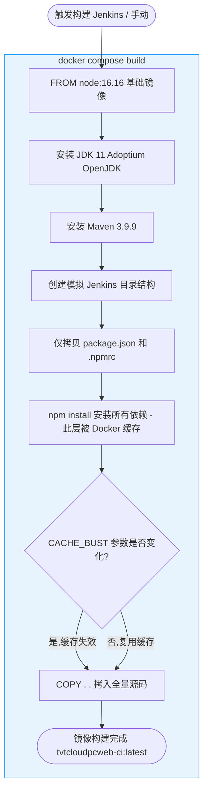
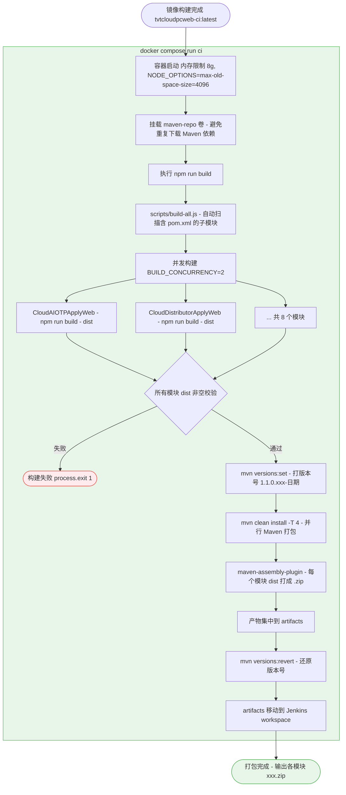
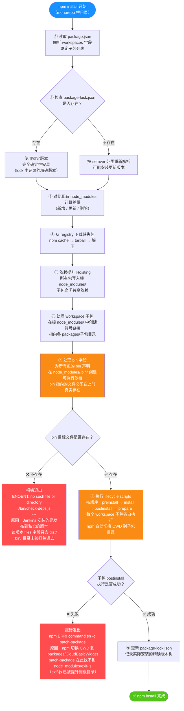

# 背景

前端十来个项目统一迁移到了新仓库, 并且更改成monorepo架构, 之前Jenkins上的打包脚本需要适配

## 思路

由于之前的旧项目已经有了打包脚本, 所以我的思路很简单, 拿来之前的脚本改两下就行, 但在实践过程中遇到了许多问题

## 挑战

事后总结, 主要是自己的电脑和Jenkins的环境不同, 很多事情很难复现, 接下来才是各种各样的问题:

1. monorepo架构附带的依赖提升导致的问题, 

2. 其次是各个开发的node版本不一致, 或者直接删除了nexus私仓的包, 导致某些项目的package-lock.json与流水线不一致, 从而又带来的许多问题

3. basicWeb(基础库)相互依赖, 导致在linux 环境出现死循环


### docker模拟Jenkins环境

作为一名开发, 最常见的一个问题就是, 自己的电脑没有任何问题, 堪称perfect, 结果一上环境就各种报错, 还不好调试

我这次也遇到了这个问题, 最后决定自己在本地启动一个docker服务, 模拟Jenkins的构建环境, 这样的话方便现在, 也方便以后调试

#### 开启虚拟化

方法很简单, 先确认电脑是否开启虚拟化

```Get-WmiObject Win32_Processor | Select-Object Name, VirtualizationFirmwareEnabled```

如果输出true, 说明虚拟化已启用

#### 安装/启用 WSL2

安装
```wsl --install```

查看是否成功
```wsl --version```


#### 下载并安装 Docker Desktop

进入官网下载并安装Docker Desktop, 然后记得修改镜像位置, 如果不像C盘被占满的话(后面迁移很麻烦)

@图12

#### docker配置

先写docker Componse 配置文件(docker-compose.ci.yml) 以及 容器镜像定义文件(Dockerfile.ci)

> docker相关的知识我也不是很懂, 大部分是让ai帮我完成的

```yml
# docker-compose.ci.yml
services:
  ci:
    build:
      context: .
      dockerfile: Dockerfile.ci
    # 与 Jenkins 保持一致的内存限制
    mem_limit: 8g
    memswap_limit: 8g
    environment:
      - NODE_OPTIONS=--max-old-space-size=4096
      - BUILD_CONCURRENCY=2
      - BUILD_NUMBER=9999
      - PROJECT_NAME=TVTCloudPcWeb
    working_dir: /data/cloud-code/cloud-web/cloud-web-pc/TVTCloudPcWeb
    volumes:
      # 持久化 Maven 本地仓库，避免每次 run 都重新下载插件/依赖
      - maven-repo:/root/.m2/repository
    # 默认执行构建；用 docker compose run ci bash 可进入交互调试
    command: ["npm", "run", "build"]

volumes:
  maven-repo:
```
docker-compose.ci.yml 主要是模拟Jenkins上的目录, 以及一些参数配置

```shell
# Dockerfile.ci

FROM node:16.16

# -------------------------------------------------------
# 安装 JDK（直接下载 Adoptium OpenJDK 11，绕过 Buster apt 问题）
# -------------------------------------------------------
ENV JAVA_HOME=/opt/java
ENV PATH=$JAVA_HOME/bin:$PATH

RUN curl -fsSL https://github.com/adoptium/temurin11-binaries/releases/download/jdk-11.0.25%2B9/OpenJDK11U-jdk_x64_linux_hotspot_11.0.25_9.tar.gz \
    | tar -xz -C /opt \
    && ln -s /opt/jdk-11.0.25+9 $JAVA_HOME

# -------------------------------------------------------
# 安装 Maven
# -------------------------------------------------------
ENV MAVEN_VERSION=3.9.9
ENV MAVEN_HOME=/opt/maven
ENV PATH=$MAVEN_HOME/bin:$PATH

RUN curl -fsSL https://archive.apache.org/dist/maven/maven-3/${MAVEN_VERSION}/binaries/apache-maven-${MAVEN_VERSION}-bin.tar.gz \
    | tar -xz -C /opt \
    && ln -s /opt/apache-maven-${MAVEN_VERSION} $MAVEN_HOME

# -------------------------------------------------------
# 模拟 Jenkins 目录结构
# gitPath:      /data/cloud-code/cloud-web/cloud-web-pc/TVTCloudPcWeb
# workspacePath: /home/ums/.jenkins/workspace/cloud-web/cloud-web-pc
# -------------------------------------------------------
ENV PROJECT_NAME=TVTCloudPcWeb
ENV GIT_PATH=/data/cloud-code/cloud-web/cloud-web-pc
ENV WORKSPACE_PATH=/home/ums/.jenkins/workspace/cloud-web/cloud-web-pc

RUN mkdir -p $GIT_PATH/$PROJECT_NAME $WORKSPACE_PATH

WORKDIR $GIT_PATH/$PROJECT_NAME

# 先拷贝 package 描述文件和 .npmrc（私仓地址），利用 Docker 缓存层加速重复构建
COPY .npmrc package.json package-lock.json* ./
COPY packages/CloudAIOTPApplyWeb/package.json        packages/CloudAIOTPApplyWeb/
COPY packages/CloudDistributorApplyWeb/package.json  packages/CloudDistributorApplyWeb/
COPY packages/CloudPartnerApplyWeb/package.json      packages/CloudPartnerApplyWeb/
COPY packages/CloudPartnerStaticApplyWeb/package.json packages/CloudPartnerStaticApplyWeb/
COPY packages/CloudUserApplyWeb/package.json         packages/CloudUserApplyWeb/
COPY packages/CloudUserStaticApplyWeb/package.json   packages/CloudUserStaticApplyWeb/
COPY packages/CloudVMSApplyWeb/package.json          packages/CloudVMSApplyWeb/
COPY packages/CloudVMSStaticApplyWeb/package.json    packages/CloudVMSStaticApplyWeb/

RUN npm install

# 再拷贝全部源码（依赖层已缓存，改代码不重装）

# 传递构建参数，只要每次传入不同的值，比如时间戳，这行指令之后的缓存就会失效
ARG CACHE_BUST=1

COPY . .
```

Dockerfile.ci 则是定义docker的基础环境, 比如node版本, 然后提前下载与Jenkins相同的JKD, MAVEN

最后则是将本地代码复制到docker里面

#### docker打包

```docker compose -f docker-compose.ci.yml build --build-arg CACHE_BUST=$(Get-Date -UFormat %s)```

一开始是直接用的docker compose -f docker-compose.ci.yml build, 但是发现每次下载太慢了, 所以使用参数控制缓存

#### 模拟流水线构建

由于Jenkins打包需要脚本, 所以在docker执行相似的脚本, 还得加上日志以及检查, 方便排查问题

```shell
#!/bin/bash
set -e

PROJECT_NAME=TVTCloudPcWeb
gitPath=/data/cloud-code/cloud-web/cloud-web-pc
workspacePath=/home/ums/.jenkins/workspace/cloud-web/cloud-web-pc
version=1.1.0.10099-$(date +%Y%m%d)
LOG_FILE=/tmp/ci-build.log

# 所有输出同时写到终端和日志文件
exec > >(tee -a "$LOG_FILE") 2>&1

cd $gitPath/$PROJECT_NAME

echo "======== Step 3: Discover modules ========"
webNames=()
for dir in $gitPath/$PROJECT_NAME/packages/*/; do
    if [ -f "$dir/pom.xml" ]; then
        webNames+=("$(basename $dir)")
    fi
done
if [ ${#webNames[@]} -eq 0 ]; then
    echo "No sub-modules found"; exit 1
fi
echo "Detected modules: ${webNames[*]}"

echo "======== Step 4: npm run build ========"
npm run build

echo ""
echo "======== Step 4 完成，检查 dist 目录 ========"
for name in "${webNames[@]}"; do
    distDir="$gitPath/$PROJECT_NAME/packages/$name/dist"
    if [ -d "$distDir" ]; then
        count=$(find "$distDir" -type f | wc -l)
        echo "  ✅ $name/dist -> $count files"
    else
        echo "  ❌ $name/dist NOT FOUND"
    fi
done

echo ""
echo "======== Step 5: Maven packaging ========"
echo "--- versions:set ---"
mvn versions:set -DnewVersion=$version

echo ""
echo "--- clean install ---"
mvn clean install -Dmaven.test.skip=true -T 4

echo ""
echo "--- 检查 artifacts 目录 ---"
if [ -d "$gitPath/$PROJECT_NAME/artifacts" ]; then
    echo "artifacts 目录内容:"
    find "$gitPath/$PROJECT_NAME/artifacts" -type f -name "*.zip" | while read f; do
        echo "  $(ls -lh "$f" | awk '{print $5, $NF}')"
    done
else
    echo "❌ artifacts 目录不存在!"
    echo "当前目录结构:"
    ls -la "$gitPath/$PROJECT_NAME/"
fi

echo ""
echo "--- versions:revert ---"
mvn versions:revert

echo ""
echo "--- 移动产物到 workspace ---"
mkdir -p $workspacePath
mv $gitPath/$PROJECT_NAME/artifacts/ $workspacePath/$PROJECT_NAME

echo ""
echo "======== 最终产物检查 ========"
if [ -d "$workspacePath/$PROJECT_NAME" ]; then
    echo "$workspacePath/$PROJECT_NAME 内容:"
    find "$workspacePath/$PROJECT_NAME" -type f -name "*.zip" | while read f; do
        echo "  $(ls -lh "$f" | awk '{print $5, $NF}')"
    done
else
    echo "❌ $workspacePath/$PROJECT_NAME 不存在!"
fi

echo ""
echo "======== 全部完成 ========"
echo "完整日志已保存到: $LOG_FILE"

```


这样一来既可以模拟Jenkins打包环境, 又可以提前发现问题

运行 ```docker run --rm --memory="8g" --memory-swap="8g" -e "NODE_OPTIONS=--max-old-space-size=4096" -e "BUILD_CONCURRENCY=2" tvtcloudpcweb-ci:latest bash scripts/ci-test.sh``` 即可





### 依赖提升

@图3

terser plugin不返回内容(不给任何报错提示)

> 经过排查, 是两个原因结合导致的

一开始以为又是依赖装的有问题, 因为我本地npm i + npm build毫无问题, 然而一到linux就会报错

经过对比, 发现主要是有两个不同

1. Jenkins指明了分配内存
2. 环境不同, 一个是window一个是linux

#### @swc/core

经过在docker反复测试以及排查, 逐个排除terser plugin的参数, 最终发现是 @swc/core 这个依赖有问题

```JavaScript
// webpack.prod.conf.js

optimization: {
  minimize: true,
  minimizer: [
    new TerserPlugin({
      minify: TerserPlugin.swcMinify,
      exclude: [/static/],
      terserOptions: {
        format: {
          comments: false,
        },
        compress: {
          drop_console: true,
          pure_funcs: ['console.log'],
        },
      },
      extractComments: false,
    }),
  ],
```

我把这里的minify换成默认的**TerserPlugin.terserMinify**就不会报错

> 当初换@swc/core是为了提升打包速度(提升速度非常明显)

然后查阅资料得知, @swc/core 在 windows和linux 可执行文件不同

@图5

到这里问题看似很明显了, 就是在windows电脑 npm i之后,下载的是windows的的依赖, 然后package-lock.json把这个依赖给锁了

所以导致去linux时, 没法安装正确的依赖

但是细想一下, 又发现不对劲, 这么明显的问题@swc/core为什么不修?

并且查看package-lock.json, 发现@swc/core是有适配这个问题的

@图6

又查了很多资料, 这才确定根因是monorepo依赖提升导致的

由于monorepo会把子项目相同的依赖都提取出来, 同时子项目都是通过@tvt/cloud-dev-dependency间接依赖的@swc/core

@tvt/cloud-dev-dependency又是在windows锁的版本

> @tvt/cloud-dev-dependency没有声明optionalDependencies

所以子项目的依赖就被锁定成window的版本, 从而导致提取之后, 根目录的@swc/core也会被锁定成window版本

解决办法很简单, 在根目录显示添加@swc/core这个依赖, 同时声明optionalDependencies

#### 内存不足

解决了依赖问题, 发现在docker上还是偶现terser plugin打包失败, 猜测是因为@swc/core用的线程比较多

pcWeb里面有8个项目, 打包脚本是8个项目同时打包, 然后还给每个线程分配了8G的内存, 并且每次出错都是最大的那两个文件

于是手动更改了分配内存为4G, 同时更改build-all脚本, 使用滑动窗口的方式进行打包, 可以配置最大并发数

```JavaScript
let index = 0
let completed = 0
let failed = false

function runNext() {
  if (failed) return
  if (index >= SUB_MODULES.length) return

  const subModule = SUB_MODULES[index++]
  const moduleTimerLabel = getTimerLabel(subModule)
  console.time(moduleTimerLabel)
  console.log(`[packaging ${subModule} start]\n`)

  const modulePath = path.resolve(PACKAGES_ROOT, subModule)
  const command = `cd ${modulePath} && npm run build`
  const distPath = path.resolve(modulePath, 'dist')

  // command 可以写成`npm run build -w ${module}`，但是性能没有直接手动切换到对应目录好，推测是在检索对应脚本导致的时间开销
  exec(command, (error, stdout, stderr) => {
    console.timeEnd(moduleTimerLabel)
    const hasError = !validGenerateDistPath(error, subModule, distPath)
    if (hasError) {
      failed = true
      handleError(subModule, stdout, stderr)
      return
    }
    console.log(`[packaging ${subModule} successful!]\n`)
    completed++
    if (completed === SUB_MODULES.length) {
      console.timeEnd(globalTimerLabel)
      console.log('[all modules packaging successful!]\n')
      console.log(`--------[✅ packaging ${PROJECT_NAME} successful end]--------\n`)
      process.exit(0)
    }
    runNext()
  })
}
// 启动初始并发槽
for (let i = 0; i < Math.min(MAX_CONCURRENCY, SUB_MODULES.length); i++) {
  runNext()
}
```

直到这时, pcWeb打包才稳定成功


### integrity不一致

#### package-lock未更新

这是构建pcWeb遇到的第一个问题

@图1

以前没有, 那是因为之前package-lock.json没有上库

> 这会导致一个潜在的问题, 本地安装的依赖和线上的不一定相同, 可能会出现意想不到的情况

一开始我很纳闷, 为什么会不一样, 到nexus对比后, 发现确实不一样, 然后推测应该是有开发在调试过程中删除了私仓的包

然后用相同版本发布上去

解决办法很简单, 升级这个依赖的版本即可

#### 发布方式不同

第二个问题猜测是发布时node版本不一致, 导致组件库checksum类型不一致

> 有些使用了SHA-512, 有些用的SHA-1

cloudApp

@图13

@图14

pcWeb

@图15

nexus

@图16

只有SHA-1

@图17

新版本又正常了

但是后来仔细一想,感觉有些不对劲, 因为开发内部node版本早就统一成16.16, 就算有时候忘记切了, 也不至于搞出这么多不一致的问题

@图18

这是ai给的回答

我决定试一下, 过程就不说了, 直接说结论

node 16.16 和 24.9.0 在发布上没有多大区别, 用的都是SHA-1

> 至于为什么不是SHA-512, 初步猜测是nexus的问题

npm pack之后, 到nexus手动上传, 那么校验和会出现一大堆

所以大面积的sha-1才是正常的...

但是这又带来了一个诡异的问题, 为什么其它开源的包用的都是SHA-512呢

@图19

ai的回答, 这一次, 我觉得具有一定的可信度

@图20

#### 发布组件前没有build

@图2

### 基础库构建失败

#### 循环依赖

一开始是不打算搞basicWeb的, 因为它是基础库, 和其它web不一样, 不需要部署到线上, 不过LD要求basicWeb也需要符合
构建和门禁的规范, 所以最终也要上流水线

但是这东西一上来就报错

@图21

这东西和前面的发布前没有build还不一样, 仔细看的话, 就会发现一个是没有命令, 这一个是没有文件

排查后发现是因为大部分基础库的package.json指定的是dist的执行文件

@图22

但是呢, 基础库已经换成了monorepo架构, 一旦npm i的话, 如果是本地的依赖, 那么就不会去远程仓库拿文件, 而是就近取材

但是呢, linux环境的代码是刚拉下来的, 所以不可能有dist文件,  导致npm 检查文件时发现少了dist/check-deps.js, 自然就会报错

npm i 失败, 所以不可能npm build, 这就尬住了

好在也有解决办法, 那就是在代码库加上bin目录, 由bin/check-deps.js 依赖dist文件

@图23

@图24

#### 补丁失效

simple-crop这个组件有个bug, 在旧版本浏览器会报错, 最后是通过patch-package打了个补丁

但是切换成monorepo架构后, patch-package安装直接失败了, 因为在CloudBasicWidget/node_modules找不到依赖

> 依赖提升到根目录了

解决办法很简单, 将patch-package命令也放到根目录, 然后把补丁也拿出来

@图25

#### 更改构建方式

之前web项目都是打成了zip包, 但是基础库不需要部署, 只需要发布, 所以需要打成tgz, 

maven的maven-assembly-plugin只能打出zip或者tag.gz, 不符合要求

所以最终使用npm自带的打包npm pack即可



### maven偶现打包失败

这个问题的现象比较诡异, 第一次打包没有问题, 第二次就会有问题, 所以之前没有发现, 并且npm build是成功的

@图8

@图9

@图26

但是maven会报错

然后我一切到之前的错误分支(master)打包失败后, 再切回最新分支(develop), 欸, 打包又成功了

经过分析, 发现了两个问题, 一个是clean-basic脚本有问题

#### 同步删除

@图27

这里只是异步删除了目录, 然后立即打印日志, 后面还有命令的话, 也会立即执行

npm build 会有大量IO操作, 这里的异步删除可能还没搞完, dist就打出来了(static特别快)

然后clean-basic就把最新的dist给删除了, 这就是为什么切换错误分支打包后, 再切回来就成功的原因

解决方案是改成同步执行, execSync

#### 锁定maven插件版本

改了clean-basic后, CloudPartnerStaticApplyWeb是不报错了, CloudUserStaticApplyWeb开始失败了

排查后, 发现maven有警告

```[WARNING] The following plugins are not marked as thread-safe in CloudUserStaticApplyWeb:```
```[WARNING]   org.apache.maven.plugins:maven-assembly-plugin:2.2-beta-5```

查阅资料得知, 2.2-beta-5有问题, 锁定maven-assembly-plugin版本即可
